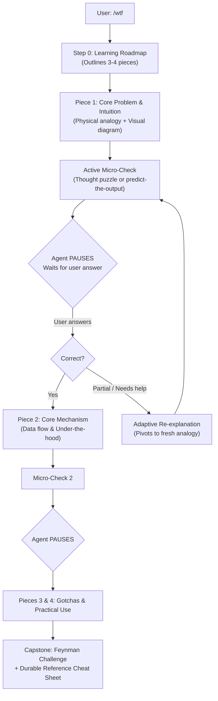
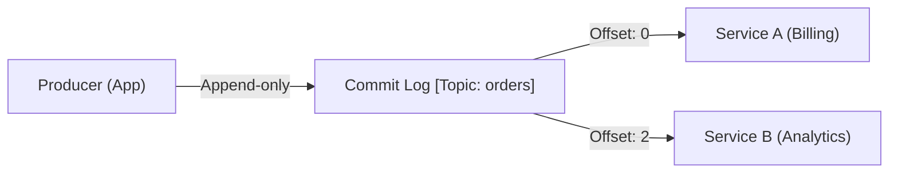

# WTF (Walk Through Foundations) — Deep Dive & Usage Guide

> *"The fastest way to master complex technology is to take it apart piece by piece with visual diagrams and active feedback."*

`wtf` is a specialized skill for AI coding agents that transforms the model from a passive encyclopedia into an interactive, Socratic tutor.

---

## Why `wtf` Exists

When developers read technical documentation or ask AI to explain a complex topic, the default output is usually a monolithic wall of text:
- **High cognitive load**: Too much information dumped into working memory at once.
- **Illusory mastery**: Reading words feels like learning, but without active retrieval, retention is near zero.
- **Missing mental models**: Complex systems involve data flows and state changes that are difficult to grasp without visual representations.

`wtf` fixes this by enforcing **progressive disclosure**, **mandatory visual diagrams**, and **interactive check gates** at every single step.

---

## The 4-Stage Learning Architecture



---

## Key Features

### 1. Mandatory Visual Graphs (Mermaid & ASCII)
Every step must provide a diagram showing data flows, state machines, tree splits, or timelines:



### 2. Audience-Calibrated Metaphors (ELI5 Mode)
The skill dynamically calibrates its depth, vocabulary, and analogies to your target perspective:

| Mode / Audience | Example Analogy | Tone & Depth |
| :--- | :--- | :--- |
| **ELI5 / Beginner** | Libraries, post offices, conveyor belts, kitchen timers | Zero jargon; simple everyday physical concepts. |
| **Software Engineer** | Call stacks, memory buffers, thread pools, pointers | Code snippets, standard patterns, and bug traps. |
| **System Architect** | Throughput vs. latency, failover modes, blast radius | High-level data flows, consensus, and system tradeoffs. |
| **Executive / Manager** | Team velocity, outage costs, regulatory compliance | Business risk, ROI, and delivery timelines. |

---

## How to Use `wtf`

### Basic Prompts
```text
/wtf is a database index
wtf is git rebase
wtf is the javascript event loop
/wtf is kafka
```

### Audience-Specific Prompts
```text
wtf is kubernetes like I am 10 years old
wtf is raft consensus to a junior engineer
explain kafka partitions like I am a product manager
```

### Cursed Code & Mystery Snippets
```text
wtf does this regex do: /^(?=.*[A-Za-z])(?=.*\d)[A-Za-z\d]{8,}$/
wtf is happening in this function: [paste code]
why is this query causing a deadlock? /wtf
```

---

## What a Session Looks Like

1. **You ask**: `/wtf is git rebase`
2. **The Agent**:
   - Outlines 3 pieces: *1. The Timeline Replay, 2. SHA Rewriting, 3. The Golden Rule*.
   - Explains Piece 1 with a `gitGraph` diagram.
   - Concludes with a micro-check: *"When Git replays your commit onto main, does it keep its SHA-1 hash or get a new one? Why?"*
   - **Stops talking and waits for you.**
3. **You reply**: *"I think it gets a new hash because the parent commit changed?"*
4. **The Agent**: Validates your insight (*"Bingo! Because the parent hash is baked into the SHA calculation..."*) and seamlessly transitions to Piece 2.

---

## Contributing

To contribute improvements or new test assertions to `wtf`:
1. Edit `skills/wtf/SKILL.md`.
2. Add new test cases to `skills/wtf/references/evals.json`.
3. Submit a pull request to `https://github.com/zxsure/skills`.
